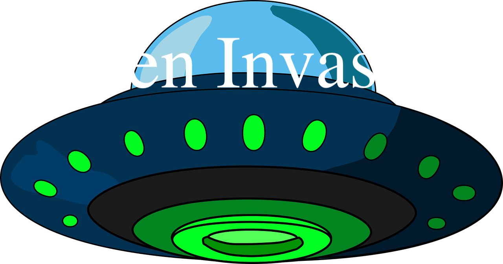
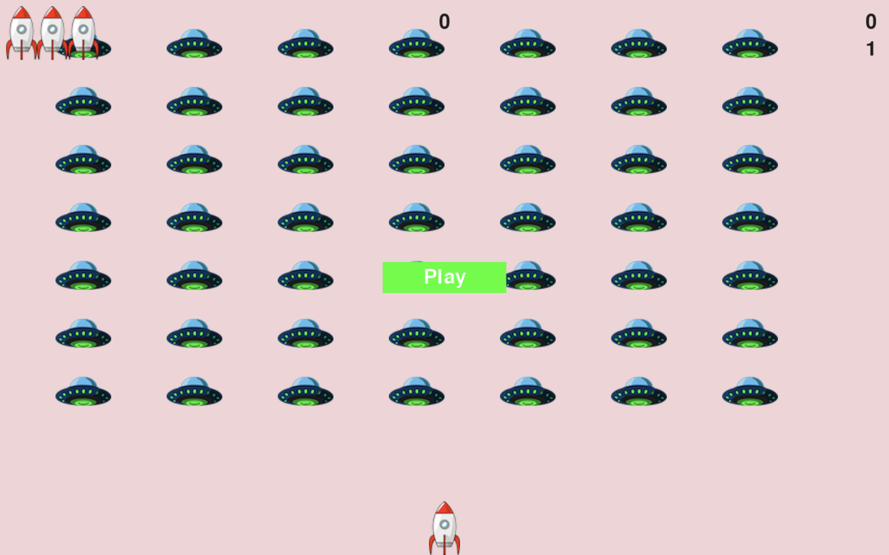

*The "Alien Invasion" game is a simple yet exciting game written in Python using the Pygame library.*
*Your goal in the game is to defend Earth from an alien invasion by shooting them with your rocket.* 
*The game offers classic retro-style gameplay enhanced with dynamic visual effects.*


### Controls:
- Move the rocket to the right: Right arrow key
- Move the rocket to the left: Left arrow key
- Shoot: Spacebar
- Quit the game: Q

### Objective:
- Shoot down the aliens before they reach the bottom of the screen.
- Earn points for each alien you successfully shoot down.

### Requirements


Windows
``` bash 
py -m pip install -U pygame --user
```
MacOs
``` bash 
python3 -m pip install -U pygame --user
```


### Instructions:
1. Clone or download the game repository to your computer.
2. Run the game by executing the `alien_invasion.py` file.

## Screenshots


## Links
- Game written with the help of the book Python Crash Course, 2nd Edition by Eric Matters
- Official Pygame website (https://www.pygame.org/)
- Graphics are from https://pixabay.com/

